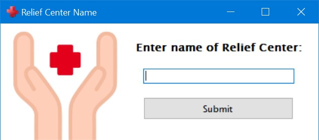
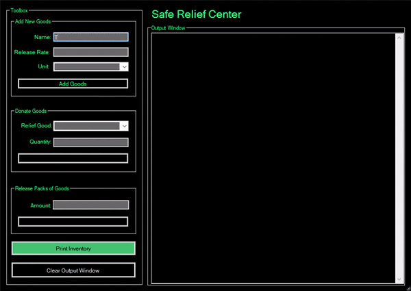

# relief-center  

### Overview   
>Designed to emulate a Relief Center's functions of receiving and donating by allowing the user to customize their inventory of goods.

My first culminating project of a programming language – C#.\
Made with **C# and Windows Forms**\
For the course: **CS 21: Introduction to Computing I** back in December 2018.\
 
[Full Project Specifications](CS21a-Final-Project-Specifications.pdf)
  
**User-asigned variables are not limited to:**
* name of relief center

* name of goods
* packaging of goods   
* amount of goods  
* amount of each good   

### Execute Program  
[Run Program](ReliefCenter.exe)   
or [See Program Code](GarciaFinalProj.sln)  
*The executable is virus-free and safe to download*

-- Giddy Garcia
